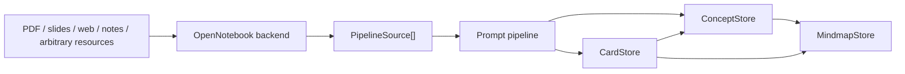

# SiYuan All-in-One Flashcards

A SiYuan plugin for concept-centered learning: OpenNotebook-backed source parsing, AI-assisted concept extraction, bidirectional concept mindmaps, and spaced-repetition flashcards.

The core idea is simple: flashcards and mindmaps should not be two disconnected artifacts. This plugin uses `ConceptNode` as the shared middle layer, so a card can point to its concept, a concept can point back to its cards, and a concept graph can become a mindmap without losing review scheduling.

## Features

- Spaced repetition review with keyboard shortcuts: SM-2 by default, optional FSRS powered by `ts-fsrs`.
- AI candidate pipeline: source text to concepts, relations, cards, and card-to-concept assignment.
- OpenNotebook integration for notebooks, sources, notes, search, chat context, and selected note detail.
- Mixed-source generation: manual snippets, OpenNotebook scoped sources/notes, and selected SiYuan docs can feed one pipeline.
- Concept-centered storage model with source references for concepts, relations, and cards.
- Bidirectional card and mindmap workflow: browse a card, sync/open its concept map, and keep card anchors in the map.
- Mindmap-to-card generation from the current map, with `linkedCardIds` preserving reverse links.
- Graph Generate: the main mixed-source workflow for concept, relation, flashcard candidates, and synchronized concept mindmaps.
- Quick Cards: a focused manual/Agent card workflow for standalone cards that do not need graph generation.
- Diagnostics panel for local stores, model config, OpenNotebook checks, and optional AI dry run.
- Provider Adapter for OpenAI-compatible services, local compatible endpoints, DeepSeek, Gemini, Anthropic, Volcano, and Zhipu.
- Import/export compatibility: import Anki `.apkg/.txt/.csv`; restore plugin-native backups from `cards-json`, `concepts-json`, and `mindmaps-markdown`; export cards JSON/CSV/Anki TSV/Markdown, concept graph JSON, and mindmap Markdown.

## Architecture



Main technical docs:

- [Architecture](docs/ARCHITECTURE.md)
- [Install and deployment](docs/INSTALL.md)
- [Testing](docs/TESTING.md)
- [Prompt strategy](docs/PROMPT_STRATEGY.md)
- [SiYuan built-in flashcard reuse decision](docs/SIYUAN_RIFF_REUSE.md)
- [GitHub preparation](docs/GITHUB_PREP.md)

## Quick Install

Download the release zip and import it from SiYuan:

1. Open SiYuan.
2. Go to Settings -> Marketplace/Community -> Plugins.
3. Import `siyuan-all-in-one-v1.0.0.zip`.
4. Enable the plugin and reload SiYuan.

For OpenNotebook-backed parsing and RAG, start OpenNotebook separately and set the plugin's Notebook endpoint, usually:

```text
http://localhost:5055
```

Model settings can use different providers/models for flashcard generation and mindmap generation. OpenAI-compatible services need a base URL, model name, and optional API key; Gemini and Anthropic use native request/response adapters.

## Development

```bash
npm install
npm run verify
```

Build:

```bash
npm run build
```

Deploy to the local SiYuan plugin directory:

```bash
npm run deploy:siyuan -- --apply
```

The deploy/check scripts auto-detect common SiYuan data directories. For custom workspaces:

```bash
npm run deploy:siyuan -- --apply --siyuan-data "/path/to/SiYuan/data"
npm run check:full -- --siyuan-data "/path/to/SiYuan/data"
```

Equivalent environment variables:

```bash
SIYUAN_DATA_DIR=/path/to/SiYuan/data
SIYUAN_PLUGIN_DIR=/path/to/SiYuan/data/plugins/siyuan-all-in-one
SIYUAN_PLUGIN_DATA_DIR=/path/to/SiYuan/data/storage/petal/siyuan-all-in-one
SIYUAN_KERNEL_ENDPOINT=http://127.0.0.1:6806
```

Run the full local check after deployment:

```bash
npm run check:full
```

Run live OpenNotebook + LLM checks:

```bash
npm run check:live
```

`check:live` calls real configured services, but the current scripts use memory stores and content-hash checks to avoid mutating real plugin data.

## Data Model

The new model centers on concepts:

- `ConceptNode`: concept title, summary, tags, sourceRefs, cardIds, parent/child/related ids.
- `Relation`: typed relation between concepts with sourceRefs.
- `Card`: review card with SM-2-compatible fields plus optional FSRS state, `conceptId`, `cardType`, and sourceRefs.
- `Mindmap`: a view generated from concept/card graph data.

This enables the new learning loop:

1. Bring complex resources into OpenNotebook, or select SiYuan docs / paste snippets directly.
2. Select sources, notes, SiYuan docs, or combine them as mixed sources.
3. Generate concept, relation, and flashcard candidates.
4. Confirm candidates.
5. Review cards through SM-2 or optional FSRS scheduling.
6. Navigate from cards to concept maps and from concept maps back to cards.

## Backup And Restore

The Import/Export panel supports two import paths:

- Anki-compatible import: `.apkg/.txt/.csv`.
- Plugin-native restore: `cards-json`, `concepts-json`, and `mindmaps-markdown`.

`mindmaps-markdown` remains markmap-compatible Markdown, with a `siyuan-all-in-one-mindmap` metadata comment for restoring `cardIds`, `linkedCardIds`, source metadata, and timestamps.

## Verification Status

Last verified on 2026-06-21:

```bash
npm run verify
npm run deploy:siyuan -- --apply
npm run check:full
npm run check:live
npm run check:data
```

## License

MIT
