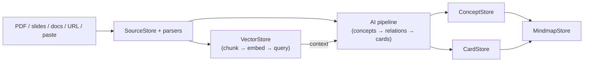

# SiYuan All-in-One Flashcards

A SiYuan plugin for concept-centered learning: AI-assisted card generation, local RAG search with multi-provider embeddings, spaced-repetition flashcards (SM-2 / FSRS), and concept mindmaps — all in one workspace.

## Features

- **5-tab layout**: 来源库 (Source Library), RAG对话 (RAG Chat), 制卡 (Card Making with sub-tabs Generate/Review/Browse/Import), 导图 (Knowledge Graph + Mindmap), 设置 (Settings).
- **Spaced repetition review**: SM-2 by default, optional FSRS via `ts-fsrs`, keyboard shortcuts, drill mechanism.
- **AI-powered card generation**: Intelligent pipeline extracts concepts, infers relations, generates cards, and assigns cards to concepts. Multi-agent system with user-defined prompt templates.
- **RAG search with multi-provider embedding**: Builtin ONNX embedder (`@huggingface/transformers` + paraphrase-multilingual-MiniLM-L12-v2) plus 15 cloud providers: Ollama, SiliconFlow, Qwen, Zhipu, Hunyuan, Baidu, Cohere, Jina, Mistral, Voyage, Gemini, Together, Nomic, OpenAI, Custom.
- **Conversation sessions**: Multi-turn RAG chat with context injection, source citation, and Agent tool-calling mode (rag_search, sql_query, get_block_content, create_note).
- **Source library**: Import from txt/md/html/csv/docx/pptx/xlsx/epub/pdf files, URLs, pasted text, or SiYuan documents. Vision formula extraction from PDFs/images via cloud API.
- **Concept graph + mindmap**: Graph and mindmap views displaying concept nodes, typed relations, and card anchors (Phase 4 — in development).
- **LLM provider system**: 18 builtin providers (DeepSeek, GLM, OpenAI, Moonshot, SiliconFlow, Volcano, MiniMax, Qwen, Hunyuan, StepFun, Lingyiwanwu, OpenCode, Gemini, Anthropic) plus custom OpenAI-compatible endpoints.
- **Import/export**: Plugin-native backup/restore for cards, concepts, mindmaps; export as JSON/CSV/Markdown.

## Architecture



Main docs: [Architecture](docs/ARCHITECTURE.md), [Install](docs/INSTALL.md), [Testing](docs/TESTING.md), [Prompt strategy](docs/PROMPT_STRATEGY.md).

## Quick Install

1. Open SiYuan → Settings → Marketplace → Plugins.
2. Import `siyuan-all-in-one-v2.0.0.zip`.
3. Enable the plugin and reload SiYuan.

## Development

```bash
npm install
npm run build        # build dist/
npm run deploy:siyuan -- --apply   # deploy to local SiYuan
npm run verify       # lint + typecheck + build
npm run check:full   # post-deploy validation
npm run check:live   # real LLM + RAG integration test
```

## Data Model

- **ConceptNode**: concept title, summary, tags, sourceRefs, cardIds, parent/child/related ids.
- **Relation**: typed relation between concepts with sourceRefs.
- **Card**: review card with SM-2/FSRS fields, conceptId, cardType, sourceRefs.
- **Mindmap**: view generated from concept/card graph data.
- **SourceRecord**: imported document with type, content, chunkStatus, metadata.
- **SessionIndex / ChatMessage**: conversation session with multi-turn messages, tool calls, source context.

## Verification Status

Last verified on 2026-06-21:

```bash
npm run verify
npm run deploy:siyuan -- --apply
npm run check:full
npm run check:live
npm run check:data
```

## License

MIT
