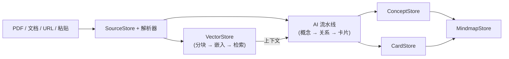

# 思源 All-in-One 知识闪卡

一个面向思源笔记的概念中心学习插件：AI 辅助制卡、本地 RAG 检索（内建 ONNX + 15 家云嵌入服务）、间隔重复复习（SM-2/FSRS）、概念导图——全部集成在一个工作台内。

## 功能特点

- **5 标签布局**：来源库、RAG 对话、制卡（制卡/复习/浏览/导入子标签）、导图（图谱视图/导图视图）、设置。
- **间隔重复复习**：默认 SM-2，可在设置中切换到 FSRS（`ts-fsrs` 驱动），支持快捷键和 drill 机制。
- **AI 智能制卡**：流水线式提取概念 → 推断关系 → 生成卡片 → 卡片归属。多 Agent 系统支持用户自定义提示词模板。
- **RAG 检索与多 Provider 嵌入**：内建 ONNX 嵌入器（`@huggingface/transformers` + paraphrase-multilingual-MiniLM-L12-v2），同时支持 15 家云嵌入服务：Ollama、SiliconFlow、Qwen、智谱、混元、百度、Cohere、Jina、Mistral、Voyage、Gemini、Together、Nomic、OpenAI、自定义。
- **对话会话**：多轮 RAG 对话，支持上下文注入、来源引用和 Agent 工具调用（知识检索、SQL 查询、获取块内容、新建笔记）。
- **来源库**：支持 txt/md/html/csv/docx/pptx/xlsx/epub/pdf 文件导入、URL 抓取、文本粘贴、思源文档选取。PDF/图片支持云端视觉 API 公式提取。
- **概念图 + 导图**：图谱和思维导图两种视图，展示概念节点、类型化关系和卡片锚点（Phase 4 开发中）。
- **LLM Provider 系统**：内置 18 家服务商（DeepSeek、智谱、OpenAI、Moonshot、硅基流动、火山引擎、MiniMax、通义千问、混元、阶跃星辰、零一万物、OpenCode、Gemini、Anthropic），支持自定义 OpenAI 兼容端点。
- **导入导出**：插件原生备份/恢复卡片、概念、导图；导出为 JSON/CSV/Markdown。

## 架构



技术文档：[架构说明](docs/ARCHITECTURE.md)、[快速部署指南](docs/INSTALL.md)、[测试与部署手册](docs/TESTING.md)、[提示词策略](docs/PROMPT_STRATEGY.md)。

## 快速安装

1. 打开思源 → 设置 → 集市 → 插件。
2. 导入 `siyuan-all-in-one-v2.0.0.zip`。
3. 启用插件并重载思源。

## 开发

```bash
npm install
npm run build        # 构建 dist/
npm run deploy:siyuan -- --apply   # 部署到本机思源
npm run verify       # lint + 类型检查 + 构建
npm run check:full   # 部署后完整检查
npm run check:live   # 真实 LLM + RAG 集成测试
```

## 数据模型

- **ConceptNode**：概念标题、摘要、标签、来源、挂载卡片、父子/相关节点。
- **Relation**：概念之间的类型化关系，保留来源引用。
- **Card**：带 SM-2/FSRS 字段、conceptId、cardType、sourceRefs 的卡片。
- **Mindmap**：由概念和卡片图谱生成的视图。
- **SourceRecord**：导入的文档，包含类型、内容、分块状态、元数据。
- **SessionIndex / ChatMessage**：对话会话，包含多轮消息、工具调用、来源上下文。

## 当前验证状态

2026-06-21 已通过：

```bash
npm run verify
npm run deploy:siyuan -- --apply
npm run check:full
npm run check:live
npm run check:data
```

## 开源协议

MIT
