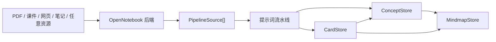

# 思源 All-in-One 知识闪卡

这是一个面向思源笔记的学习插件：用 OpenNotebook 后端负责资源解析和检索，用 AI 抽取概念、关系和闪卡候选，再用概念图谱把思维导图与 SM-2 闪卡连接起来。

核心范式：闪卡和思维导图不再是两套彼此孤立的数据。插件以 `ConceptNode` 作为中间层，让卡片能指向概念，概念能反查卡片，概念关系能生成思维导图，同时卡片仍然保留间隔重复调度。

## 功能特点

- SM-2 间隔重复复习，支持键盘快捷键。
- AI 候选流水线：来源文本到概念、关系、卡片、卡片归属。
- OpenNotebook 集成：notebook、source、note、search、chat context、选中笔记详情。
- 混合来源候选生成：手动片段、OpenNotebook 选源/选笔记、思源文档可以一起进入同一条流水线。
- 概念中心数据模型：概念、关系、卡片都保留来源引用。
- 卡片与导图双向工作流：从卡片同步/打开概念导图，导图里保留卡片锚点。
- 导图制卡：从当前导图节点生成闪卡，并用 `linkedCardIds` 保持导图反向关联。
- 诊断面板：检查本地数据、模型配置、OpenNotebook 连接和 AI dry run。
- Provider Adapter：支持 OpenAI-compatible、本地兼容服务、DeepSeek、Gemini、Anthropic、火山、智谱等配置差异。
- 导入导出：导入 Anki `.apkg/.txt/.csv`，导出卡片 JSON/CSV/Anki TSV/Markdown、概念图 JSON、导图 Markdown。

## 架构



技术文档：

- [架构说明](docs/ARCHITECTURE.md)
- [快速部署指南](docs/INSTALL.md)
- [测试与部署手册](docs/TESTING.md)
- [提示词策略](docs/PROMPT_STRATEGY.md)
- [GitHub 准备清单](docs/GITHUB_PREP.md)

## 快速安装

下载 release zip 后在思源中导入：

1. 打开思源。
2. 进入 `设置 -> 集市/社区 -> 插件`。
3. 导入 `siyuan-all-in-one-v1.0.0.zip`。
4. 启用插件并重载思源。

如果要使用 OpenNotebook 负责资源解析和 RAG，请单独启动 OpenNotebook，并在插件设置里配置 Notebook endpoint，通常是：

```text
http://localhost:5055
```

模型设置支持分别指定闪卡模型和导图模型。OpenAI-compatible 服务只需填写 base URL、model 和 API key；Gemini 和 Anthropic 会自动使用各自原生请求格式。本地兼容服务可以留空 API key。

## 开发

```bash
npm install
npm run verify
```

构建：

```bash
npm run build
```

部署到本机思源插件目录：

```bash
npm run deploy:siyuan -- --apply
```

部署/检查脚本会自动探测常见的思源 data 目录。如果你的工作空间是自定义路径：

```bash
npm run deploy:siyuan -- --apply --siyuan-data "/path/to/SiYuan/data"
npm run check:full -- --siyuan-data "/path/to/SiYuan/data"
```

也可以用环境变量：

```bash
SIYUAN_DATA_DIR=/path/to/SiYuan/data
SIYUAN_PLUGIN_DIR=/path/to/SiYuan/data/plugins/siyuan-all-in-one
SIYUAN_PLUGIN_DATA_DIR=/path/to/SiYuan/data/storage/petal/siyuan-all-in-one
SIYUAN_KERNEL_ENDPOINT=http://127.0.0.1:6806
```

部署后完整检查：

```bash
npm run check:full
```

真实 OpenNotebook + LLM 检查：

```bash
npm run check:live
```

`check:live` 会调用真实配置的服务，但当前脚本使用内存 store 和内容哈希检查，避免修改真实插件数据。

## 数据模型

新模型以概念为中心：

- `ConceptNode`：概念标题、解释、标签、来源、挂载卡片、父子/相关节点。
- `Relation`：概念之间的类型化关系，并保留来源。
- `Card`：带 `conceptId`、`cardType`、`sourceRefs` 的 SM-2 卡片。
- `Mindmap`：由概念和卡片图谱生成的视图。

学习闭环：

1. 把复杂资源交给 OpenNotebook，也可以直接选择思源文档或粘贴片段。
2. 在插件里选择 source、note、思源文档，或组合成混合来源。
3. 生成概念、关系和闪卡候选。
4. 人工确认候选。
5. 用 SM-2 复习卡片。
6. 从卡片跳到概念导图，再从导图回到卡片。

## 当前验证状态

2026-06-21 已通过：

```bash
npm run verify
npm run deploy:siyuan -- --apply
npm run check:full
npm run check:live
npm run check:data
```

## 开源协议

MIT
