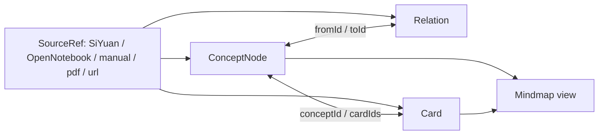
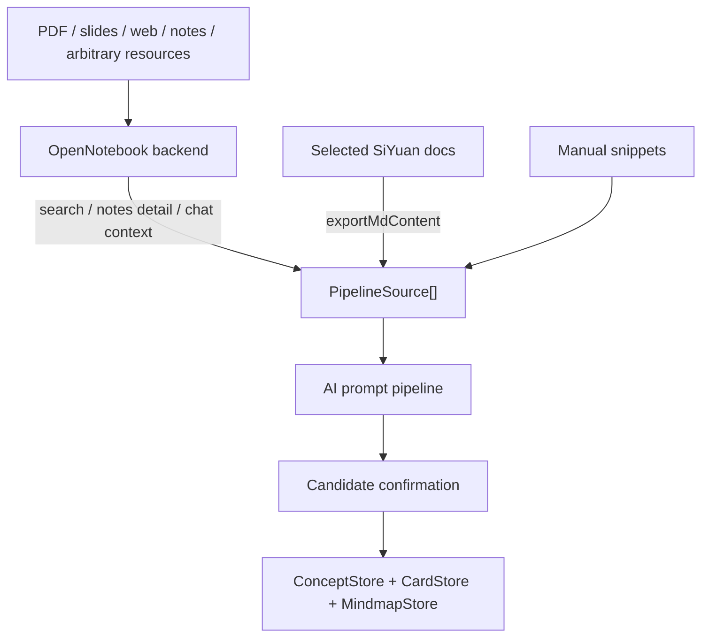

# siyuan-all-in-one 技术架构说明

本文档记录当前代码中已经实现并通过验证的架构，目的是降低后续重构、上 GitHub、接入 OpenNotebook 后端时的幻觉和误判。

## 1. 插件边界

插件入口在 `src/index.ts`，继承 SiYuan npm 包提供的 `Plugin` 类。当前使用到的 SiYuan 插件能力包括：

- `addTab`：注册主工作台 Tab，挂载 `App.svelte`。
- `addTopBar`：注册顶栏入口按钮，点击后通过 `openTab` 打开插件 Tab。
- `Dialog`：承载设置面板 `Settings.svelte`。
- `loadData/saveData`：持久化配置、卡片、概念、关系、导图。
- `openSetting`：插件自己的设置入口。

本项目不直接写 SiYuan 工作空间文件，核心数据走插件存储目录：

```text
<SiYuan data>/storage/petal/siyuan-all-in-one/
```

当前约定的存储 key：

- `config`：模型、OpenNotebook 端点、学习参数。
- `cards`：闪卡数据。
- `concepts`：概念节点。
- `relations`：概念关系。
- `mindmaps`：插件内导图数据。

部署目录：

```text
<SiYuan data>/plugins/siyuan-all-in-one/
```

构建后由 `scripts/deploy_siyuan.mjs --apply` 复制 `dist/index.js`、`dist/index.css`、`plugin.json`、`icon.png`、README 和 i18n 文件。

## 2. 顶层 UI 结构

`src/App.svelte` 是插件工作台壳层，左侧是图标导航，右侧按 `activeTab` 切换面板。

主要面板：

- `Review.svelte`：复习入口，按设置选择 SM-2 或 FSRS。
- `Browse.svelte`：卡片浏览、编辑、从卡片跳转概念导图。
- `Generate.svelte`：快速制卡入口，保留手动/Agent 单独制卡，并引导到 `Concepts.svelte` 的图谱生成主流程。
- `Notebook.svelte`：OpenNotebook 笔记本、来源、笔记、聊天上下文。
- `Concepts.svelte`：图谱生成主入口，负责概念/关系/卡片候选确认，连接 OpenNotebook、思源文档和新数据模型。
- `Mindmap.svelte`：导图视图，包含概念导图。
- `Diagnostics.svelte`：本地数据、配置、OpenNotebook、AI dry run 诊断。
- `Models.svelte` / `Settings.svelte` / `Stats.svelte` / `Import.svelte`：配置、模型、统计、导入导出。

面板间跳转通过函数 props 完成，不使用全局事件总线：

- `openSourceRef(ref)`：打开 SiYuan 块、URL，或跳到 Notebook 面板定位 OpenNotebook source。
- `openConceptsFromNotebook(request)`：Notebook 面板将 query/sourceIds/noteIds 交给 Concepts 面板。
- `jumpToMindmap(mindmapId)`：从 Browse/Concepts 跳到 Mindmap 面板。

`conceptSourceTargetSeq` 用来解决重复点击同一个 Notebook 来源时 Svelte 不触发更新的问题。

## 3. 核心数据模型

当前新范式不是“闪卡附属导图”或“导图附属闪卡”，而是以概念节点为中间层：



关键文件：

- `src/libs/types.ts`：`Card`、`CardStatus`、`Provider`、`AgentConfig`、`AppConfig` 等正源类型定义。
- `src/libs/types/concept.ts`：`ConceptNode`、`Relation`、`SourceRef`、`CardCandidate`、`PipelineResult`。
- `src/libs/store/concept-store.ts`：概念和关系 CRUD、卡片关联、sourceRefs 清洗。
- `src/libs/store.ts`：卡片 CRUD、去重、统计、导入导出。
- `src/libs/srs.ts`：复习调度入口，SM-2 和 FSRS 双调度器，含 drill 机制、consecutiveLapses 追踪。
- `src/libs/siyuan-riff.ts`：思源内置 Riff 闪卡 API 的薄适配层。
- `src/libs/riff-sync.ts`：插件卡片同步到思源文档块和 Riff 卡包的编排层，使用 `riff-sync` 持久化映射避免重复写入，并在卡片编辑后更新原思源块。

这种结构让双向联动自然成立：

- 从导图节点可以看到挂载卡片。
- 从卡片可以反查概念节点。
- 概念关系可以生成导图，而卡片仍保留复习调度。
- `SourceRef` 让概念、关系、卡片都能回到证据来源。

## 4. OpenNotebook 接入

OpenNotebook 客户端在 `src/libs/notebook.ts`。

已实现能力：

- `listNotebooks`
- `getNotebook`
- `listSources`
- `getSource`
- `search`
- `searchInSources`
- `buildContext`
- `listSessions/createSession/deleteSession/getSession/sendMessage`
- `listNotes`
- `getNote`
- `getModels/getDefaultModels/updateDefaultModels/autoAssignModels`

当前策略是让 OpenNotebook 后端承担复杂资源解析和 RAG 检索，插件保留思源文档、手动片段和学习结构化：



`src/libs/sources/source-hub.ts` 是统一来源层。`Concepts.svelte` 只把用户选择传给 `collectPipelineSources`，不再直接拼接手动文本、OpenNotebook 和思源文档。这样后续加入本地文件解析、Unstructured worker 或其他后端时，只需要新增 source adapter，并继续输出统一的 `PipelineSource[]`。

当前 SourceHub 支持：

- `manual`：手动文本，直接归一化为 `manual-1`。
- `opennotebook`：OpenNotebook query/sourceIds/noteIds。
- `siyuan`：混合模式里的选中思源文档。
- `file`：混合模式里的本地 `.txt/.md/.markdown/.html/.htm`，由 `src/libs/sources/local-file-adapters.ts` 做轻量解析和切块。
- 统一去重：按 `type/sourceId/blockId/chunkId/text` 合并重复来源。

`src/libs/ai/source-adapters.ts` 把 OpenNotebook 返回归一化成 `PipelineSource`。现在 `noteIds` 有两条路径：

- 直接调用 `/api/notes/{noteId}` 获取选中笔记正文。
- 继续调用 `/api/search`，并用 `sourceIds + noteIds` 做客户端范围过滤。

这样用户明确选中笔记时，即使搜索没有命中，也能把该笔记作为候选生成输入。

`src/libs/ai/siyuan-source-adapters.ts` 把思源文档 Markdown 归一化成 `PipelineSource`，保留文档 block id：

- `type: "siyuan"`
- `sourceId/blockId/chunkId: <doc block id>`
- `quote`: 文档开头证据片段
- `text`: 标题、blockId、截断后的 Markdown 正文

`Concepts.svelte` 当前支持三种候选来源模式：

- 手动文本：粘贴任意非结构化片段。
- OpenNotebook：搜索或从 Notebook 面板传入 source/note 范围。
- 混合来源：手动片段 + OpenNotebook 搜索/选中笔记 + 多个思源文档一起进入同一个 prompt pipeline。

## 5. AI 流水线

流水线入口在 `src/libs/ai/pipeline.ts`：

1. `runPromptPipeline(sources, options)`
2. `extract-concepts`
3. `infer-relations`
4. `generate-cards`
5. `confirmPipelineResult`
6. `syncConceptMindmap`

提示词模板在 `src/libs/ai/prompts/`：

- `contracts.ts`：统一输出契约和闪卡质量契约。
- `extract-concepts.ts`：抽取概念候选。
- `infer-relations.ts`：推断概念关系。
- `generate-cards.ts`：生成卡片候选。
- `assign-cards.ts`：把卡片归属到概念。

输出不是直接写入存储，而是先生成候选，让用户确认。确认时才写入：

- 概念：`ConceptStore.create/update`
- 关系：`ConceptStore.addRelation`
- 卡片：`CardStore.add`
- 卡片到概念：`ConceptStore.attachCard`

因此当前已经有一个统一落点，可以承载三条用户路径：

- 一次性生成：来源直接生成概念、关系、卡片，再确认写入。
- 先制卡再制图：旧卡片可以继续复习；带 `conceptId` 的新卡片能同步到概念导图。
- 先做图再制卡：`Mindmap.svelte` 可以从当前导图节点生成卡片；如果节点标题匹配概念标题，会自动挂到对应 `conceptId`。

候选确认区已经支持写入前编辑：

- 概念：标题、摘要。
- 关系：起点、终点、关系类型。
- 卡片：正面、背面、提示、卡片类型、关联概念。

编辑后关联仍以候选内部的 `tempId` 为锚点；改概念标题不会断开关系和卡片归属，改卡片归属会直接更新 `conceptTempId`，确认写入时再映射到真实 `conceptId`。
`scripts/test_pipeline.mjs` 有隔离回归用例，模拟用户编辑概念标题、关系端点和卡片归属后再确认，验证写入后的 `Relation.fromId/toId`、`Card.conceptId` 和 `ConceptNode.cardIds` 仍保持一致。

导图制卡路径：

1. `src/libs/mindmap-cards.ts` 解析当前 markmap Markdown，提取节点路径。
2. LLM 根据节点路径生成卡片草稿。
3. `Mindmap.svelte` 创建间隔重复卡片，写入 `CardStore`。
4. 如果草稿 topic 匹配已有概念标题，则调用 `ConceptStore.attachCard` 保持概念关联。
5. `MindmapStore.upsert` 合并 `linkedCardIds`，让导图能反查由它生成的新卡片。

## 6. 导入导出兼容

导入入口在 `src/panels/Import.svelte`，Anki 解析在 `src/libs/anki.ts`。

已支持导入：

- Anki `.txt/.csv`：Tab、分号、竖线分隔。
- Anki `.apkg`：旧版 Anki SQLite 包（浏览器端读取新版加密格式不可行）。
- 插件 `cards-json`：通过 `CardStore.importCards` 清洗并按 id 合并。
- 插件 `concepts-json`：通过 `ConceptStore.importGraph` 恢复概念、关系和卡片，重新同步父子/相关关系索引。
- 插件 `mindmaps-markdown`：通过 `src/libs/importers.ts` 读取 `siyuan-all-in-one-mindmap` 元数据注释，并用 `MindmapStore.importMindmaps` 按 id 合并 `cardIds`/`linkedCardIds`。

导出入口同样在 `Import.svelte`，格式构建在 `src/libs/exporters.ts`：

- `cards-json`：完整保留 SM-2/FSRS、`conceptId`、`cardType`、`sourceRefs`。
- `cards-csv`：适合表格软件和二次清洗。
- `anki-tsv`：正面、背面、提示、牌组、标签，便于导入 Anki 类工具。
- `cards-markdown`：阅读/归档友好的卡片 Markdown。
- `concepts-json`：概念、关系、卡片一起导出，保留双向联动数据。
- `mindmaps-markdown`：导出 markmap 兼容缩进列表，并写入 `siyuan-all-in-one-mindmap` JSON 注释，保留 `cardIds`、`linkedCardIds`、来源和时间戳，便于恢复导图-闪卡关联。

## 7. LLM 输出稳定性

LLM 客户端在 `src/libs/llm.ts`，已经实现：

- Provider Adapter：统一 `ChatMessage[]` 输入，按 provider 生成不同请求协议。
- OpenAI-compatible chat completion 调用。
- Gemini `generateContent` 原生请求和响应解析。
- Anthropic `/v1/messages` 原生请求和响应解析。
- Provider-aware structured output：JSON 步骤优先请求原生 JSON mode，失败时回退 prompt-only。
- `getProviderCapabilities(providerId)`：集中描述 provider 的结构化输出策略，并供设置页展示。
- 429 指数退避。
- DeepSeek 模型显式禁用 thinking，降低非标准输出概率。
- `parseLLMJSON` 宽松 JSON 修复。

Provider 配置由 `resolveLLMConfig(appConfig, providerId, model)` 统一解析：


当前 provider 协议边界：

- OpenAI-compatible：DeepSeek、OpenAI、Moonshot、SiliconFlow、MiniMax、自定义兼容服务。
- OpenAI-compatible 变体：智谱使用 `/chat/completions`，火山引擎使用 `/api/v3/chat/completions`。
- Gemini：系统提示词放入 `systemInstruction`，用户/助手消息转成 `contents[].parts[].text`。
- Anthropic：系统提示词放入顶层 `system`，消息只保留 `user/assistant`。

结构化输出策略参考了 OpenAI-compatible JSON mode、Gemini `responseMimeType`、以及结构化输出项目常见的“原生约束优先，失败回退提示词约束”模式：

- OpenAI-compatible：`response_format: { type: "json_object" }`。
- Gemini：`generationConfig.responseMimeType = "application/json"`。
- Anthropic：不伪造不兼容字段，继续使用严格 system prompt。
- 自定义兼容服务：如果返回 `400/404/422` 且错误指向 `response_format/json/schema` 不支持，pipeline 自动重试普通请求。

设置页会显示每个 provider 的 JSON 策略标签：

- `JSON 原生`：当前为 Gemini，使用 provider 原生 JSON 约束。
- `JSON mode + 回退`：OpenAI-compatible provider，先试 JSON mode，不支持时由 pipeline 回退。
- `JSON 提示词`：当前为 Anthropic，只依赖严格提示词和后处理解析。

测试脚本 `scripts/test_llm_providers.mjs` 覆盖 endpoint 解析、鉴权头、请求体、provider capability、结构化输出请求、响应文本抽取和空 API key 本地模型场景。`scripts/test_pipeline.mjs` 覆盖 JSON mode 不支持时的回退路径。

JSON 修复覆盖场景：

- Markdown fenced code block。
- OpenAI-ish wrapper。
- `output[].content[].text`。
- `message.content[]`。
- 注释、尾逗号、未加引号 key。
- 单引号字符串。
- 全角标点。
- Python `True/False/None`。
- 非字符串 `NaN/Infinity`。
- 字符串中的裸换行和 tab。

即使模型返回不稳定，流水线也会尽量降级：

- 无概念则返回 warnings。
- 无卡片则用概念生成保守 fallback card candidates。
- 证据不足内容进入 `uncertain`，不强行写入概念图。

## 8. 公式渲染

公式渲染入口在 `src/libs/render.ts`。

当前策略：

- 优先使用 SiYuan 运行时的 Lute `Md2HTMLDOM` 把 Markdown/LaTeX 转成 HTML。
- 优先使用 SiYuan `siyuan.mathRender` 渲染公式。
- 如果 SiYuan math renderer 不可用，再尝试 MathJax 3。
- 如果没有 Lute，则使用保守 HTML 转义 fallback，保留 `$...$`、`\(...\)`、`\[...\]` 原文，避免公式被吞掉或变成不安全 HTML。

已接入公式渲染的 UI：

- Review 卡片正反面。
- Browse 卡片列表和详情。
- Notebook 聊天消息。
- Concepts 候选确认区。
- Mindmap 节点点击后的复习浮层。

导图 markdown 还有额外约束：节点必须是一行。`toInlineMathText` 会把 `\[...\]` 和 `$$...$$` 转成单行 `$...$`，避免 display math 换行破坏 markmap 的缩进列表。

## 9. 诊断与可观测性

`Diagnostics.svelte` 提供插件内诊断：

- 本地数据数量。
- 模型配置。
- Provider 结构化输出策略：`structuredOutputStrategy`、展示标签、是否使用原生 JSON 约束、是否支持不兼容回退。
- OpenNotebook 连接与检索。
- 可选 AI dry run。
- 可复制 JSON 报告。

报告只暴露 `apiKeySet`、`baseUrlSet` 和结构化输出能力，不复制真实 API key。

脚本层诊断：

- `check_siyuan_integration.mjs`：部署目录和数据目录。
- `check_data_compat.mjs`：真实数据只读兼容性。
- `check_runtime.mjs`：SiYuan 进程、kernel、插件启用和 JS/CSS 哈希。
- `check_bundle_integrity.mjs`：bundle 是否包含关键模块、provider 结构化输出诊断字段，且不含配置中的 secret。
- `check_ai_live.mjs`：真实 OpenNotebook + LLM 候选生成。
- `check_e2e_live.mjs`：真实候选生成 + 内存确认 + 内存导图同步，并用内容哈希确认不改真实数据。

## 10. 当前已验证状态

截至 2026-06-21，本轮验证通过：

- `npm run verify`
- `npm run deploy:siyuan -- --apply`
- `npm run check:full`
- `npm run check:live`
- `npm run check:data`

`check:runtime` 确认 SiYuan 3.6.5 正在运行，插件已启用，运行时加载的 JS/CSS 与部署目录一致。

`check:live` 确认 OpenNotebook + DeepSeek 可以生成概念、关系、卡片，并能在内存 store 中确认和同步概念导图。

## 11. 复习算法与大图优化路线

当前复习路径已经支持两种调度器：

- `SM-2`：默认调度器，字段简单，兼容旧卡片和现有导入导出。
- `FSRS`：通过 `open-spaced-repetition/ts-fsrs` 接入，可在设置页切换。FSRS 比 SM-2 多建模 stability、difficulty、retrievability，更适合个体化调度。

为了保持已有数据兼容，当前采用“双字段”策略：

- 保留现有 `interval/ease/reps/lapses/status/due`，继续兼容现有卡片和导出。
- 新增可选 `scheduler` / `fsrs` 字段，记录 FSRS 的 stability、difficulty、retrievability、lastReview。
- `scheduleCard(grade, card, scheduler)` 是统一入口；`Review.svelte` 和 `Mindmap.svelte` 都按配置调用它。
- `cards-json` 完整保留 FSRS 状态；CSV 额外导出 `scheduler` 和 `fsrs` 列，便于迁移排查。

后续可继续参考 `open-spaced-repetition/fsrs4anki` / optimizer 做参数训练和复习日志回放；当前版本先使用 `ts-fsrs` 默认 FSRS-6 参数，避免过早引入复杂参数 UI。

思源内置闪卡复用结论见 `docs/SIYUAN_RIFF_REUSE.md`。核心判断是：不能直接复制或 import 思源 Riff 代码替换插件现有卡片模型，但可以通过 `/api/riff/*` 复用思源内核 FSRS、卡包和到期队列。当前实现做成手动同步层，并用 `saveData('riff-sync')` 保存 `cardId -> blockId/deckId/docId` 映射，避免重复同步；如果插件卡片后续编辑，会用 `/api/block/updateBlock` 更新原块。Riff 仍不是插件的唯一真源。

SiYuanMemo 借鉴结论见 `docs/SIYUANMEMO_REVIEW.md`，功能覆盖矩阵见 `docs/SIYUANMEMO_COVERAGE.md`。核心判断是：SiYuanMemo 同样没有把块和卡片强绑定为一对一，而是保留块作为双链/上下文锚点，同时支持一块多卡、块级复习、筛选复习、神经漫游和 CDF 概念描述符制卡。因此本插件应继续以 `Concept/Card/Mindmap + SourceRef` 为结构化真源，并把思源块/Riff 作为可同步、可回跳、可审计的投影层。

大思维导图当前仍以 markmap 为主，因为它和 Markdown、SiYuan 文档块天然契合。已落地的低风险优化：

- `profileMindmapMarkdown` 统计节点数、卡片节点数、最大深度。
- `Mindmap.svelte` 根据体量自动降低 `initialExpandLevel`：小图展开更深，大图只展开主干。
- `getMindmapRenderTuning` 根据体量调整 markmap 渲染：大图禁用动画、延迟 fit、分批绑定卡片节点点击事件，避免首次渲染卡顿。
- `searchMindmapNodes` 直接遍历 markmap 数据树，可以按节点标题、路径和卡片 ID 搜索；`focusMindmapSearchMatch` 会展开祖先节点，调用 markmap 的 `setHighlight/ensureVisible` 定位当前命中。
- `filterMindmapMarkdown` 在不修改保存 Markdown 的前提下提供 `全部 / 有卡 / 缺卡 / 邻域` 四种显示范围，用于发现“哪些知识点还没做成闪卡”和“当前搜索命中附近有什么”。
- 画布会按 `large/huge` 体量加 class，便于后续继续针对超大图做样式和交互降级。
- UI 显示节点画像，让用户知道大图已进入降压渲染模式。

后续如果概念图达到数千节点，应考虑从“单张树图”升级为“可检索的分层图”：

- markmap：继续负责 Markdown 树形导图和卡片复习入口。
- Sigma.js / WebGL graph：作为超大概念关系图的备选渲染层。
- Graphology / Cytoscape 风格的数据结构：作为布局、过滤、邻域展开的中间层。

优先级建议：

1. 给 FSRS 增加参数预设、复习日志回放和未来的 optimizer 导入。
2. 给导图加仅显示当前节点邻域、按概念/卡片/来源过滤。
3. 当真实用户图谱超过 markmap 舒适区，再引入 WebGL 图层，而不是提前替换现有导图体验。
