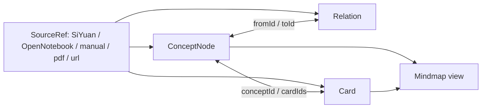
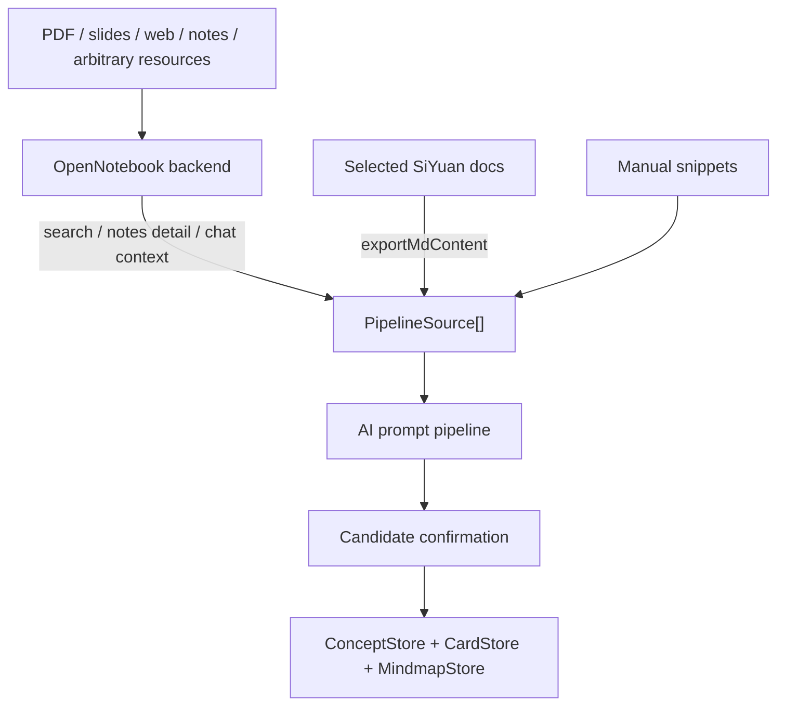
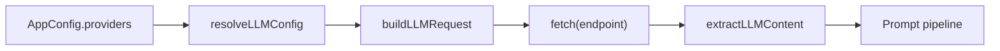

# siyuan-all-in-one 技术架构说明

本文档记录当前代码中已经实现并通过验证的架构，目的是降低后续重构、上 GitHub、接入 OpenNotebook 后端时的幻觉和误判。

## 1. 插件边界

插件入口在 `src/index.ts`，继承 SiYuan npm 包提供的 `Plugin` 类。当前使用到的 SiYuan 插件能力包括：

- `addTab`：注册主工作台 Tab，挂载 `App.svelte`。
- `addTopBar`：注册顶栏入口按钮，点击后通过 `openTab` 打开插件 Tab。
- `Dialog`：承载设置面板 `Settings.svelte`。
- `loadData/saveData`：持久化配置、卡片、概念、关系、导图。
- `openSetting`：插件自己的设置入口。

本项目不直接写 SiYuan 工作空间文件，核心数据走插件存储目录：

```text
<SiYuan data>/storage/petal/siyuan-all-in-one/
```

当前约定的存储 key：

- `config`：模型、OpenNotebook 端点、学习参数。
- `cards`：闪卡数据。
- `concepts`：概念节点。
- `relations`：概念关系。
- `mindmaps`：插件内导图数据。

部署目录：

```text
<SiYuan data>/plugins/siyuan-all-in-one/
```

构建后由 `scripts/deploy_siyuan.mjs --apply` 复制 `dist/index.js`、`dist/index.css`、`plugin.json`、`icon.png`、README 和 i18n 文件。

## 2. 顶层 UI 结构

`src/App.svelte` 是插件工作台壳层，左侧是图标导航，右侧按 `activeTab` 切换面板。

主要面板：

- `Review.svelte`：SM-2 复习。
- `Browse.svelte`：卡片浏览、编辑、从卡片跳转概念导图。
- `Generate.svelte`：旧的主题制卡入口。
- `Notebook.svelte`：OpenNotebook 笔记本、来源、笔记、聊天上下文。
- `Concepts.svelte`：概念/关系/卡片候选确认，连接 OpenNotebook 和新数据模型。
- `Mindmap.svelte`：导图视图，包含概念导图。
- `Diagnostics.svelte`：本地数据、配置、OpenNotebook、AI dry run 诊断。
- `Models.svelte` / `Settings.svelte` / `Stats.svelte` / `Import.svelte`：配置、模型、统计、导入导出。

面板间跳转通过函数 props 完成，不使用全局事件总线：

- `openSourceRef(ref)`：打开 SiYuan 块、URL，或跳到 Notebook 面板定位 OpenNotebook source。
- `openConceptsFromNotebook(request)`：Notebook 面板将 query/sourceIds/noteIds 交给 Concepts 面板。
- `jumpToMindmap(mindmapId)`：从 Browse/Concepts 跳到 Mindmap 面板。

`conceptSourceTargetSeq` 用来解决重复点击同一个 Notebook 来源时 Svelte 不触发更新的问题。

## 3. 核心数据模型

当前新范式不是“闪卡附属导图”或“导图附属闪卡”，而是以概念节点为中间层：



关键文件：

- `src/libs/types/concept.ts`：`ConceptNode`、`Relation`、`SourceRef`、`CardCandidate`、`PipelineResult`。
- `src/libs/types/card.ts`：新 `Card` 类型包含 `conceptId`、`cardType`、`sourceRefs`。
- `src/libs/store/concept-store.ts`：概念和关系 CRUD、卡片关联、sourceRefs 清洗。
- `src/libs/store.ts`：卡片 CRUD、去重、统计、导入导出。
- `src/libs/srs/sm2.ts`：适配新 Card 类型的 SM-2。

这种结构让双向联动自然成立：

- 从导图节点可以看到挂载卡片。
- 从卡片可以反查概念节点。
- 概念关系可以生成导图，而卡片仍保留复习调度。
- `SourceRef` 让概念、关系、卡片都能回到证据来源。

## 4. OpenNotebook 接入

OpenNotebook 客户端在 `src/libs/notebook.ts`。

已实现能力：

- `listNotebooks`
- `getNotebook`
- `listSources`
- `getSource`
- `search`
- `searchInSources`
- `buildContext`
- `listSessions/createSession/deleteSession/getSession/sendMessage`
- `listNotes`
- `getNote`
- `getModels/getDefaultModels/updateDefaultModels/autoAssignModels`

当前策略是让 OpenNotebook 后端承担复杂资源解析和 RAG 检索，插件保留思源文档、手动片段和学习结构化：



`src/libs/ai/source-adapters.ts` 把 OpenNotebook 返回归一化成 `PipelineSource`。现在 `noteIds` 有两条路径：

- 直接调用 `/api/notes/{noteId}` 获取选中笔记正文。
- 继续调用 `/api/search`，并用 `sourceIds + noteIds` 做客户端范围过滤。

这样用户明确选中笔记时，即使搜索没有命中，也能把该笔记作为候选生成输入。

`src/libs/ai/siyuan-source-adapters.ts` 把思源文档 Markdown 归一化成 `PipelineSource`，保留文档 block id：

- `type: "siyuan"`
- `sourceId/blockId/chunkId: <doc block id>`
- `quote`: 文档开头证据片段
- `text`: 标题、blockId、截断后的 Markdown 正文

`Concepts.svelte` 当前支持三种候选来源模式：

- 手动文本：粘贴任意非结构化片段。
- OpenNotebook：搜索或从 Notebook 面板传入 source/note 范围。
- 混合来源：手动片段 + OpenNotebook 搜索/选中笔记 + 多个思源文档一起进入同一个 prompt pipeline。

## 5. AI 流水线

流水线入口在 `src/libs/ai/pipeline.ts`：

1. `runPromptPipeline(sources, options)`
2. `extract-concepts`
3. `infer-relations`
4. `generate-cards`
5. `confirmPipelineResult`
6. `syncConceptMindmap`

提示词模板在 `src/libs/ai/prompts/`：

- `contracts.ts`：统一输出契约和闪卡质量契约。
- `extract-concepts.ts`：抽取概念候选。
- `infer-relations.ts`：推断概念关系。
- `generate-cards.ts`：生成卡片候选。
- `assign-cards.ts`：把卡片归属到概念。

输出不是直接写入存储，而是先生成候选，让用户确认。确认时才写入：

- 概念：`ConceptStore.create/update`
- 关系：`ConceptStore.addRelation`
- 卡片：`CardStore.add`
- 卡片到概念：`ConceptStore.attachCard`

因此当前已经有一个统一落点，可以承载三条用户路径：

- 一次性生成：来源直接生成概念、关系、卡片，再确认写入。
- 先制卡再制图：旧卡片可以继续复习；带 `conceptId` 的新卡片能同步到概念导图。
- 先做图再制卡：`Mindmap.svelte` 可以从当前导图节点生成卡片；如果节点标题匹配概念标题，会自动挂到对应 `conceptId`。

候选确认区已经支持写入前编辑：

- 概念：标题、摘要。
- 关系：起点、终点、关系类型。
- 卡片：正面、背面、提示、卡片类型、关联概念。

编辑后关联仍以候选内部的 `tempId` 为锚点；改概念标题不会断开关系和卡片归属，改卡片归属会直接更新 `conceptTempId`，确认写入时再映射到真实 `conceptId`。

导图制卡路径：

1. `src/libs/mindmap-cards.ts` 解析当前 markmap Markdown，提取节点路径。
2. LLM 根据节点路径生成卡片草稿。
3. `Mindmap.svelte` 创建 SM-2 卡片，写入 `CardStore`。
4. 如果草稿 topic 匹配已有概念标题，则调用 `ConceptStore.attachCard` 保持概念关联。
5. `MindmapStore.upsert` 合并 `linkedCardIds`，让导图能反查由它生成的新卡片。

## 6. 导入导出兼容

导入入口在 `src/panels/Import.svelte`，Anki 解析在 `src/libs/anki.ts`。

已支持导入：

- Anki `.txt/.csv`：Tab、分号、竖线分隔。
- Anki `.apkg`：旧版 Anki SQLite 包（浏览器端读取新版加密格式不可行）。

导出入口同样在 `Import.svelte`，格式构建在 `src/libs/exporters.ts`：

- `cards-json`：完整保留 SM-2、`conceptId`、`cardType`、`sourceRefs`。
- `cards-csv`：适合表格软件和二次清洗。
- `anki-tsv`：正面、背面、提示、牌组、标签，便于导入 Anki 类工具。
- `cards-markdown`：阅读/归档友好的卡片 Markdown。
- `concepts-json`：概念、关系、卡片一起导出，保留双向联动数据。
- `mindmaps-markdown`：导出 markmap 兼容缩进列表。

## 7. LLM 输出稳定性

LLM 客户端在 `src/libs/llm.ts`，已经实现：

- Provider Adapter：统一 `ChatMessage[]` 输入，按 provider 生成不同请求协议。
- OpenAI-compatible chat completion 调用。
- Gemini `generateContent` 原生请求和响应解析。
- Anthropic `/v1/messages` 原生请求和响应解析。
- 429 指数退避。
- DeepSeek 模型显式禁用 thinking，降低非标准输出概率。
- `parseLLMJSON` 宽松 JSON 修复。

Provider 配置由 `resolveLLMConfig(appConfig, providerId, model)` 统一解析：



当前 provider 协议边界：

- OpenAI-compatible：DeepSeek、OpenAI、Moonshot、SiliconFlow、MiniMax、自定义兼容服务。
- OpenAI-compatible 变体：智谱使用 `/chat/completions`，火山引擎使用 `/api/v3/chat/completions`。
- Gemini：系统提示词放入 `systemInstruction`，用户/助手消息转成 `contents[].parts[].text`。
- Anthropic：系统提示词放入顶层 `system`，消息只保留 `user/assistant`。

测试脚本 `scripts/test_llm_providers.mjs` 覆盖 endpoint 解析、鉴权头、请求体、响应文本抽取和空 API key 本地模型场景。

JSON 修复覆盖场景：

- Markdown fenced code block。
- OpenAI-ish wrapper。
- `output[].content[].text`。
- `message.content[]`。
- 注释、尾逗号、未加引号 key。
- 单引号字符串。
- 全角标点。
- Python `True/False/None`。
- 非字符串 `NaN/Infinity`。
- 字符串中的裸换行和 tab。

即使模型返回不稳定，流水线也会尽量降级：

- 无概念则返回 warnings。
- 无卡片则用概念生成保守 fallback card candidates。
- 证据不足内容进入 `uncertain`，不强行写入概念图。

## 8. 公式渲染

公式渲染入口在 `src/libs/render.ts`。

当前策略：

- 优先使用 SiYuan 运行时的 Lute `Md2HTMLDOM` 把 Markdown/LaTeX 转成 HTML。
- 优先使用 SiYuan `siyuan.mathRender` 渲染公式。
- 如果 SiYuan math renderer 不可用，再尝试 MathJax 3。
- 如果没有 Lute，则使用保守 HTML 转义 fallback，保留 `$...$`、`\(...\)`、`\[...\]` 原文，避免公式被吞掉或变成不安全 HTML。

已接入公式渲染的 UI：

- Review 卡片正反面。
- Browse 卡片列表和详情。
- Notebook 聊天消息。
- Concepts 候选确认区。
- Mindmap 节点点击后的复习浮层。

导图 markdown 还有额外约束：节点必须是一行。`toInlineMathText` 会把 `\[...\]` 和 `$$...$$` 转成单行 `$...$`，避免 display math 换行破坏 markmap 的缩进列表。

## 9. 诊断与可观测性

`Diagnostics.svelte` 提供插件内诊断：

- 本地数据数量。
- 模型配置。
- OpenNotebook 连接与检索。
- 可选 AI dry run。
- 可复制 JSON 报告。

报告只暴露 `apiKeySet`，不复制真实 API key。

脚本层诊断：

- `check_siyuan_integration.mjs`：部署目录和数据目录。
- `check_data_compat.mjs`：真实数据只读兼容性。
- `check_runtime.mjs`：SiYuan 进程、kernel、插件启用和 JS/CSS 哈希。
- `check_bundle_integrity.mjs`：bundle 是否包含关键模块且不含配置中的 secret。
- `check_ai_live.mjs`：真实 OpenNotebook + LLM 候选生成。
- `check_e2e_live.mjs`：真实候选生成 + 内存确认 + 内存导图同步，并用内容哈希确认不改真实数据。

## 9. 当前已验证状态

截至 2026-06-21，本轮验证通过：

- `npm run verify`
- `npm run deploy:siyuan -- --apply`
- `npm run check:full`
- `npm run check:live`
- `npm run check:data`

`check:runtime` 确认 SiYuan 3.6.5 正在运行，插件已启用，运行时加载的 JS/CSS 与部署目录一致。

`check:live` 确认 OpenNotebook + DeepSeek 可以生成概念、关系、卡片，并能在内存 store 中确认和同步概念导图。
