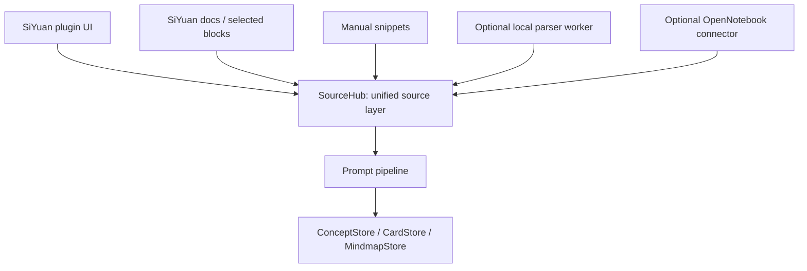

# 后端与资源解析策略

目标：判断 OpenNotebook 作为外置后端是否过重、是否应该改用 Unstructured 或其他可内置解析方案，并明确插件长期架构边界。

## 当前结论

短期不应把 OpenNotebook 删除。它仍然适合作为可选的外置 NotebookLM 后端，负责复杂资料库、聊天、全文/向量搜索和已有 notebook/source/note 资产复用。

但 OpenNotebook 不应该成为插件的唯一资源入口。真实运行已经暴露两个问题：

- `/api/sources?limit=200&notebook_id=...` 会因 OpenNotebook 当前 schema 限制直接 422，说明插件必须适配后端版本契约。
- `/api/search` 的 `vector` 检索在本机实例返回 500，而 `text` 检索正常，说明向量索引、embedding 配置或后端数据状态会直接影响插件生成体验。

因此当前最佳路线是“双轨资源层”：

1. 轻量内置解析层：优先服务 SiYuan 文档、Markdown、纯文本、HTML、常见 office/PDF 的本地抽取，保证插件开箱可用。
2. OpenNotebook 连接器：作为高级外部来源，保留已有 notebook、搜索、聊天和多模态资料库。

## OpenNotebook 的定位

OpenNotebook 是完整研究平台，不只是解析库。它的公开说明强调多模型、隐私、自托管、多模态资料组织、全文/向量搜索、上下文聊天和 podcast 生成。GitHub 项目也把它定位成 open-source NotebookLM alternative，支持 PDF、视频、音频、网页等多模态内容。

适合继续使用的场景：

- 用户已经维护 OpenNotebook 资料库。
- 需要跨大量资料搜索、问答、聊天上下文。
- 需要复用 OpenNotebook 的 source/note/session 结构。
- 需要比插件内置解析更强的资料处理能力。

不适合作为唯一依赖的原因：

- 部署重：独立服务、数据库、模型/embedding 配置、索引状态都需要维护。
- 版本漂移：API schema、参数上限、返回字段可能变化。
- 错误半径大：vector 500 这类后端内部错误会中断插件生成链路。
- 与 SiYuan 原生体验割裂：用户只是想从当前文档/选区制卡制图时，不应被要求先导入另一个资料库。

当前代码策略：

- `OpenNotebookClient.listSources` clamp `limit` 到 1-100，并对 notebook id 格式做兼容 fallback。
- `OpenNotebookClient.search` 对 vector 失败回退 text，再回退极简 text payload。
- `fetchOpenNotebookPipelineSources` 默认 text 搜索，避免在当前后端上默认触发 vector 500。
- `Notebook.svelte` 显示连接错误和重试入口，不再静默清空来源。

## Unstructured 的定位

Unstructured 更适合作为“解析/预处理层”，不是 OpenNotebook 的完整替代品。官方文档和仓库都强调 `partition`：自动检测文件类型，把原始非结构化文档拆成结构化元素，例如 `Title`、`NarrativeText`、`ListItem` 等。`unstructured-api` 提供通用预处理 pipeline，覆盖 txt、html、md、json、rtf、图片、doc/docx、ppt/pptx、pdf、epub、csv、xlsx 等类型。

适合引入的场景：

- 用户导入本地 PDF、docx、pptx、html、epub 等文件，希望直接变成 `PipelineSource[]`。
- 需要保留标题、列表、表格、页码等结构信息，给提示词做更稳定的证据切块。
- 需要一个比 OpenNotebook 更窄、更可控的本地解析 worker。

不能解决的问题：

- 它不提供完整 notebook、source、note、session、聊天 UI。
- 它不是检索系统；仍需本地索引或直接把解析结果送入 LLM。
- Python 依赖和 OCR/PDF 高级依赖仍然可能较重，不适合直接塞进纯前端插件 bundle。

## 推荐架构

新增 `SourceHub` 抽象后，所有来源都产出统一 `PipelineSource[]`：

- `siyuan-doc`: 当前已实现，调用 SiYuan `exportMdContent`。
- `manual`: 当前已实现。
- `opennotebook`: 当前已实现，并补了兼容 fallback。
- `local-file`: 后续新增，先支持纯文本、Markdown、HTML；再接 PDF/docx/pptx。
- `unstructured-worker`: 可选高级解析器，不作为默认依赖。

## 内置后端可行性

纯前端插件适合内置：

- Markdown/纯文本/HTML 清洗。
- SiYuan 文档、块、属性读取。
- 小文件直接解析。
- 基于当前资料的 prompt chunking。
- 轻量 BM25/关键词检索。

不适合直接内置到前端 bundle：

- 大 PDF OCR。
- 视频/音频转录。
- 大规模向量索引。
- Python 生态解析库完整依赖。
- 后台长任务队列。

更合理的形态：

1. 默认无后端：SiYuan 文档、手动文本、Markdown/HTML 小文件直接可用。
2. 可选轻量本地 helper：Node/Python 子进程或独立 localhost 服务，负责文件解析，不负责整个 NotebookLM。
3. 可选 OpenNotebook：高级资料库和聊天。
4. 可选 Unstructured：本地 helper 的解析引擎之一。

## 对 SiYuan 原生闪卡的复用判断

SiYuan 自身已经包含闪卡间隔重复能力，官方 README 功能列表包含 “Flashcard spaced repetition”。Riff 仓库说明它是 SiYuan 的 spaced repetition component，特性包括 FSRS 和数据持久化，许可证为 AGPL-3.0，并致谢 MIT 的 go-fsrs。

插件应该复用的部分：

- `/api/riff/*` 的卡包、到期队列、复习提交。
- 以思源块作为可回跳锚点。
- 把插件卡片投影到思源块，再加入 Riff 卡包。

插件不应该直接复用/复制的部分：

- 不直接复制 Riff 或 SiYuan 内核代码进插件。
- 不把 Riff 数据结构当作唯一真源。
- 不让一张卡只能对应一个块。SiYuanMemo 的经验也表明，一块多卡、块级复习、同来源聚合都很重要。

当前路线正确：`Card/Concept/Mindmap/SourceRef` 是结构化真源，Riff 是投影层。下一步应该把 `auditRiffSyncProjection` 接到 UI，显示 fresh/stale/unsynced/orphan。

## 下一步实现顺序

P0：稳定现有 OpenNotebook 连接器

- 已完成：sources limit clamp、notebook id fallback、search fallback、Notebook UI 错误提示。
- 继续：Diagnostics 里显示 OpenNotebook schema/version、text/vector 健康状态。

P1：SourceHub 抽象

- 把 `Concepts.svelte` 里的来源拼接迁移到 `src/libs/sources/source-hub.ts`。
- 给每种 source adapter 加合约测试。
- UI 上让“手动 / SiYuan / OpenNotebook / 文件”并列，而不是把 OpenNotebook 当主线。

P2：轻量本地文件解析

- 已实现 `.md/.txt/.html/.htm`：浏览器端读取本地文本文件，HTML 做保守去标签和实体解码，再切成 `file` 类型的 `PipelineSource[]`。
- 再评估浏览器端 PDF/docx/pptx 解析库。
- 文件解析结果进入候选确认区，不直接写卡。

P3：可选 Unstructured helper

- 不打包进默认插件。
- 提供 endpoint 配置和健康检查。
- 返回 Unstructured elements 后映射为 `PipelineSource`，保留 element type、page、source file、metadata。

P4：OpenNotebook 降级策略

- 如果 OpenNotebook 不可用，生成区仍可用 SiYuan/手动/文件来源。
- 如果 vector 搜索失败，只降级本次搜索，不阻断 selected source/note 详情读取。
- 如果搜索结果没有正文，优先按 source id 补 `getSource` 全文。

## 参考链接

- SiYuan README: https://github.com/siyuan-note/siyuan
- Riff: https://github.com/siyuan-note/riff
- OpenNotebook: https://github.com/lfnovo/open-notebook
- OpenNotebook website: https://www.open-notebook.ai/
- Unstructured: https://github.com/Unstructured-IO/unstructured
- Unstructured overview: https://docs.unstructured.io/open-source/introduction/overview
- Unstructured partitioning: https://docs.unstructured.io/open-source/core-functionality/partitioning
- Unstructured API: https://github.com/Unstructured-IO/unstructured-api
