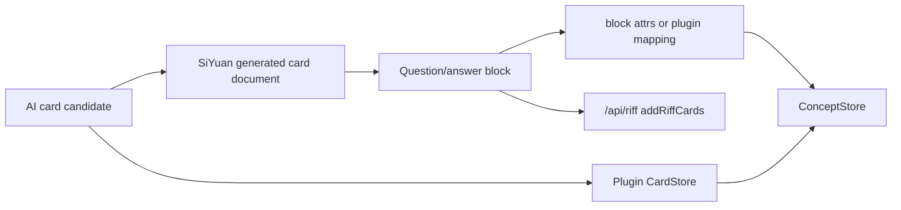

# 思源内置闪卡复用判断

本文记录 2026-06-21 对思源闪卡功能的资料和源码审计结论。目标是判断本插件的闪卡功能能否直接复用思源自带代码，以及后续应怎样接入才最稳。

## 1. 查阅资料

已查阅：

- 思源用户指南闪卡文章：`https://siyuannote.com/article/1725202936`
- 思源内核路由源码：`https://github.com/siyuan-note/siyuan/blob/master/kernel/api/router.go`
- 思源 Riff API 实现：`https://github.com/siyuan-note/siyuan/blob/master/kernel/api/riff.go`
- 思源前端复习 UI：`https://github.com/siyuan-note/siyuan/blob/master/app/src/card/openCard.ts`
- Riff 间隔重复组件：`https://github.com/siyuan-note/riff`

用户指南页标题为“闪卡-FSRS算法间隔重复”，目录包含“内容块”“基于文档”“基于卡包”“设置”“技术实现”。这说明思源内置闪卡是块级、文档级、卡包级的 FSRS 复习系统。

## 2. 源码事实

思源内核暴露了完整的 Riff API：

- `/api/riff/createRiffDeck`
- `/api/riff/renameRiffDeck`
- `/api/riff/removeRiffDeck`
- `/api/riff/getRiffDecks`
- `/api/riff/addRiffCards`
- `/api/riff/removeRiffCards`
- `/api/riff/getRiffDueCards`
- `/api/riff/getTreeRiffDueCards`
- `/api/riff/getNotebookRiffDueCards`
- `/api/riff/reviewRiffCard`
- `/api/riff/skipReviewRiffCard`
- `/api/riff/getRiffCards`
- `/api/riff/getTreeRiffCards`
- `/api/riff/getNotebookRiffCards`
- `/api/riff/resetRiffCards`
- `/api/riff/batchSetRiffCardsDueTime`
- `/api/riff/getRiffCardsByBlockIDs`

`kernel/api/riff.go` 的关键行为：

- `addRiffCards` 接收 `deckID` 和 `blockIDs`，通过事务 `addFlashcards` 把思源内容块加入卡包。
- `getRiffDueCards` 接收 `deckID` 和 `reviewedCards`，返回 `cards`、未复习总数、新卡数、旧卡数。
- `reviewRiffCard` 接收 `deckID`、`cardID`、`rating`、`reviewedCards`，调用 `model.ReviewFlashcard`。
- `skipReviewRiffCard` 接收 `deckID`、`cardID`。

`siyuan-note/riff` 的关键事实：

- Riff 是 Go 组件，不是前端 npm 包。
- `Card` 接口核心是 `ID()`、`BlockID()`、`NextDues()`、`SetDue()`、`GetLapses()`、`GetReps()`、`GetState()`、`GetLastReview()`。
- `FSRSStore` 使用 `github.com/open-spaced-repetition/go-fsrs/v3`，数据用 msgpack 持久化。
- `Deck` 默认 `AlgoFSRS`，以 `cardID + blockID` 作为卡片核心，不保存插件自己的 `front/back/conceptId/sourceRefs`。

`app/src/card/openCard.ts` 的关键事实：

- 思源自带复习 UI 调用 `/api/riff/getRiffDueCards`、`/api/riff/getTreeRiffDueCards`、`/api/riff/getNotebookRiffDueCards` 获取复习队列。
- 评分时调用 `/api/riff/reviewRiffCard`，跳过时调用 `/api/riff/skipReviewRiffCard`。
- 复习内容通过块编辑器渲染 block，而不是渲染外部 JSON 卡片。
- 自带 UI 会遍历插件并调用 `updateCards(cardsData)`，插件理论上可参与内置卡片数据后处理，但这不是本插件当前核心数据模型。

## 3. 结论

不能“直接复用思源自带闪卡代码”来替换本插件现有闪卡系统。

原因：

- 思源 Riff 核心是 Go 代码和内核状态，Svelte 插件不能直接 import。
- Riff 代码使用 AGPL-3.0；本插件当前是 MIT。直接复制 Riff Go/TS 实现会带来许可证不兼容风险。
- 思源内置卡片是块级卡片，核心锚点是 `blockID`。本插件当前卡片是插件 JSON 数据，核心字段是 `question/answer/hint/conceptId/cardType/sourceRefs/fsrs`。
- 思源内置复习 UI 渲染的是块内容，不理解本插件的概念图谱、候选编辑、OpenNotebook sourceRefs、导图 linkedCardIds。

可以复用的是“内核 Riff 能力和 UI 风格”，尤其是通过 HTTP API 接入：

- 使用 `/api/riff/*` 复用思源 FSRS 调度、卡包、到期队列、评分日志。
- 使用思源块作为生成卡片的外显载体，把插件生成卡片写入一个思源文档，再把这些 blockID 加入 Riff 卡包。
- 把 `conceptId/sourceRefs/cardType` 保存在块属性或插件自己的映射表里，继续维护导图和概念关系。
- 复习 UI 可以继续使用本插件自定义界面，也可以提供“同步到思源闪卡”按钮，让用户在思源原生复习入口里复习这些块。

## 4. 推荐架构

短期继续保持当前插件自有 `CardStore`：

- 现有 `CardStore` 对 AI 生成候选、编辑、导入导出、概念图谱、导图制卡更友好。
- 当前已经有 SM-2 默认和可选 `ts-fsrs`，足够支撑插件闭环。
- 不改变用户已有 133 张插件卡片，风险最低。

中期增加可选 Riff 同步层：

建议新增设置项：

- `reviewBackend: "plugin" | "siyuan-riff"`
- 默认 `plugin`，避免破坏现有数据和导入导出。
- 开启 `siyuan-riff` 后，新增卡片先写入思源文档块，再通过 `/api/riff/addRiffCards` 加入卡包。
- 保留插件 `CardStore` 作为图谱和导入导出索引，不把 Riff 当作唯一真源。

长期可以探索：

- 读取 `/api/riff/getRiffCardsByBlockIDs` 判断块是否已是思源闪卡。
- 对已同步到 Riff 的卡片，在插件复习页显示“由思源 Riff 调度”。
- 提供从插件卡片批量生成思源块并加入 Riff 的迁移工具。
- 提供从思源已有 Riff 卡片读取 blockID，反向创建概念关联的入口。

## 5. 已落地到本仓库

新增 `src/libs/siyuan-riff.ts`，作为薄 API 适配层：

- `getRiffDecks`
- `createRiffDeck`
- `addRiffCards`
- `removeRiffCards`
- `getRiffDueCards`
- `reviewRiffCard`
- `skipReviewRiffCard`

新增 `scripts/test_siyuan_riff.mjs`，用 stub 的 `fetchSyncPost` 验证端点、payload 和返回归一化。这个适配层目前不接管现有复习，只为后续“同步到思源内置闪卡”提供安全入口。

新增 `src/libs/riff-sync.ts`，作为受保护的同步编排层：

- `syncCardsToSiyuanRiff(cards, options)`：把插件卡片批量写入思源文档块，再把新块加入 Riff 卡包。
- `ensureRiffDeck(name)`：复用已有卡包，缺失时创建。
- `cardToRiffMarkdown(card)`：把插件卡片转换成可由思源原生复习 UI 渲染的 Markdown。
- `cleanRiffSyncState(raw)`：清洗插件侧同步索引，避免重复同步同一张卡。

同步时会写入块属性：

- `custom-aio-card-id`
- `custom-aio-concept-id`
- `custom-aio-card-type`
- `custom-aio-source-refs`

新增 `scripts/test_riff_sync.mjs`，用 stub 的思源 API 验证文档创建、块插入、属性写入和 `/api/riff/addRiffCards` 调用。这个测试不访问真实思源工作空间。

`导入与导出` 面板已提供手动同步入口。该入口默认不自动运行，点击后还会弹出思源确认框；用户可以填写目标卡包和批量上限，确认后才会创建思源文档块并加入 Riff 卡包。

同步成功后，插件会把 `cardId -> blockId/deckId/docId` 映射保存到 `saveData('riff-sync')`。下一次同步同一卡包时会先读取该映射：未变化的卡片直接跳过，已编辑的卡片调用 `/api/block/updateBlock` 更新原思源块，再刷新块属性。这样既避免用户重复点击后生成重复文档块，也避免思源原生卡包里的块内容长期落后于插件卡片。思源侧仍保留块属性作为可读元数据；插件侧映射用于稳定去重和后续跳转/迁移。

`riff-sync` 是本机同步状态，不是跨设备知识备份的核心内容，因为里面保存的是当前思源工作空间里的 blockID/docID。`导入与导出` 面板会显示当前本机记录数，并提供“清除记录”按钮；该操作只清除插件侧同步索引，不删除思源文档块，也不删除 Riff 卡包中的闪卡。清除后再次同步会重新创建块。

## 6. 决策

当前版本不应直接改为使用思源 Riff 作为唯一闪卡存储。

更稳的路线是：

1. 继续使用插件自己的 `CardStore + ConceptStore + MindmapStore` 支撑新范式。
2. 保留 `ts-fsrs` 作为插件内复习算法，保证离线、导入导出和跨平台 zip 安装稳定。
3. 增加“同步到思源闪卡/Riff”的可选能力，复用思源原生 FSRS、卡包和文档复习体验。
4. 用块属性或映射表保留概念、来源和导图关联，避免 Riff 的 blockID 模型吞掉插件的图谱语义。
